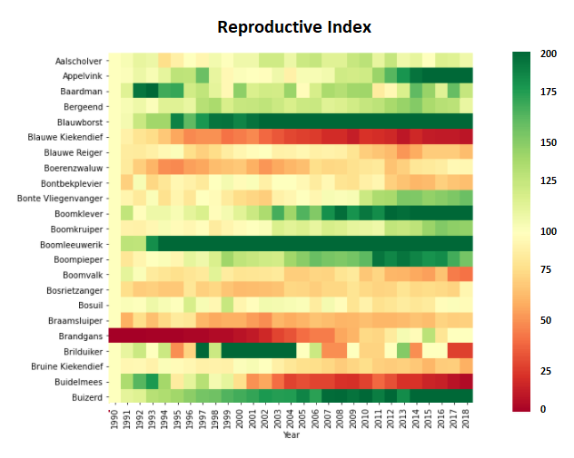

## Breeding bird trends 

CBS (Statistics Netherlands) provides reliable statistical information and data to provide insights into social issues. The 0DATA API allows users to consistently access this data. 

The Breeding bird dataset provides insights into the breeding trends of endemic species that regularly breed in The Netherlands. My goal was to use the CBS API to explore this dataset and determine which birds show the  strongest positive and negative trend over the past 12 years.

  - Used the CBS API to access the breeding bird dataset
  - Created a while loop with an input variable that allows readers to plot the reproductive trend of their species of interest
  - Produced a heatmap showing the reproductive index over time 
  - Concluded that the klapekster shows the strongest decrease and the roodborsttapuit the strongest increase over the past 12 years

